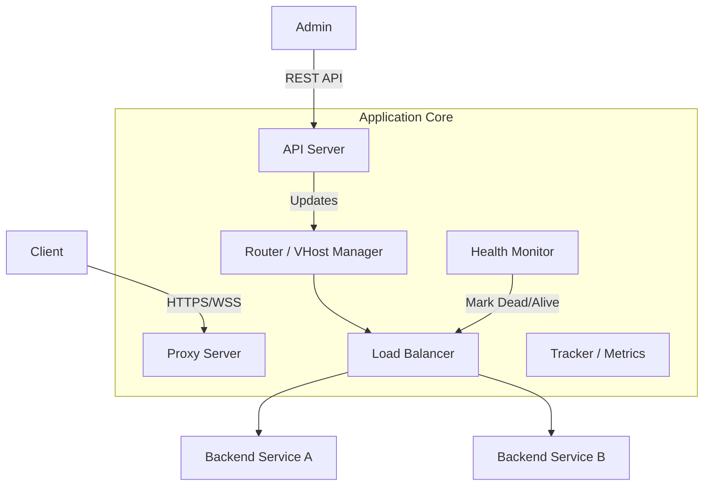

# Project Specification: TypeScript Dynamic Reverse Proxy

## 1. System Overview
A high-performance, event-driven reverse proxy server built on Node.js and TypeScript. It routes incoming HTTP, HTTPS, and WebSocket traffic to backend services based on dynamic configurations managed via a RESTful API.

### Key Objectives
*   **Type Safety:** Full TypeScript implementation for reliability.
*   **Dynamic Configuration:** Routes and backends can be added/removed at runtime without restarts.
*   **Resilience:** Passive health checks, circuit breaking, and request queuing.
*   **Observability:** Real-time metrics and structured logging.

---

## 2. Architecture

The system is divided into two distinct planes:

1.  **Data Plane (Proxy Engine):** Handles the actual traffic, SSL termination, load balancing, and request forwarding.
2.  **Control Plane (Management API):** A REST API to configure routes, certificates, and view statistics.

### Component Diagram


---

## 3. Data Models (TypeScript Interfaces)

These interfaces define the core structures derived from your existing `host.js`, `route.js`, and `request.js`.

### 3.1. Configuration Models
```typescript
// Enums for strategies
export enum BalancingStrategy {
  ROUND_ROBIN = 'ROUND_ROBIN',
  IP_HASH = 'IP_HASH',
  RANDOM = 'RANDOM',
  LEAST_LATENCY = 'LEAST_LATENCY'
}

// A backend server (Target)
export interface Backend {
  id: string;
  hostname: string; // IP or Domain
  port: number;
  weight?: number;
  
  // Runtime state
  isDead: boolean;
  deadSince?: number;
  failureCount: number;
}

// A Virtual Host Route
export interface RouteConfig {
  id: string;
  vHost: string; // e.g., "api.example.com" or "*.example.com"
  strategy: BalancingStrategy;
  
  // Settings
  autoHttps: boolean;
  reqQueueLength: number; // Max queued requests
  reqActiveLength: number; // Max concurrent requests
  
  // Security
  authProvider?: string; // Reference to auth service
  headers?: Record<string, string>; // Custom headers to inject
  
  backends: Backend[];
  
  // SSL Context (optional)
  ssl?: {
    key: string;
    cert: string;
  };
}
```

### 3.2. Runtime Models
```typescript
import { IncomingMessage, ServerResponse } from 'http';

export interface ProxyRequest {
  id: string;
  req: IncomingMessage;
  res: ServerResponse;
  startTime: number;
  retries: number;
  meta: {
    vHost: string;
    clientIp: string;
  };
}
```

---

## 4. Functional Requirements

### 4.1. Proxy Engine
*   **Protocol Support:** HTTP/1.1, HTTP/2 (optional but recommended), and WebSockets.
*   **SSL Termination:**
    *   Must support SNI (Server Name Indication) to serve different certificates per vHost.
    *   Certificates must be updateable at runtime via the API.
*   **Request Queuing (Backpressure):**
    *   Implement the logic from `lib/queue.js`.
    *   If active requests > `reqActiveLength`, push to queue.
    *   If queue > `reqQueueLength`, reject with 503/502.
*   **Header Manipulation:**
    *   Automatically add `X-Forwarded-For`, `X-Real-IP`, `X-Forwarded-Proto`.
    *   Inject custom headers defined in `RouteConfig`.

### 4.2. Load Balancing Strategies
Implement the logic found in `lib/strategies/`:
1.  **Round Robin:** Cycle through available backends.
2.  **Random:** Select random backend.
3.  **IP Hash:** Consistent hashing based on Client IP (ensures session stickiness).
4.  **Latency:** (Advanced) Track response times and pick the fastest backend.

### 4.3. Health Checking & Circuit Breaking
*   **Passive Check:** If a request fails (ECONNREFUSED, ETIMEDOUT), mark the backend as `dead`.
*   **Retry Logic:** If a backend fails, retry `N` times on different backends before failing the client request.
*   **Recovery:** Periodically check dead hosts (e.g., every 60s) to see if they are reachable (TCP Ping or single HTTP probe).

### 4.4. Authentication (Middleware)
*   Support for Basic Auth or Bearer Token validation.
*   To maintain parity with the legacy code, allow an "Auth Provider" hook (an async callback or external API call) to validate credentials before proxying.

---

## 5. API Specification (Control Plane)

The API allows external systems to control the proxy.

**Base URL:** `/api/v1`

### 5.1. Routes Management
*   `GET /routes` - List all configured routes.
*   `POST /routes` - Create a new vHost route.
    *   *Body:* `RouteConfig`
*   `GET /routes/:vHost` - Get details for a specific route.
*   `DELETE /routes/:vHost` - Remove a route.

### 5.2. Backend Management
*   `POST /routes/:vHost/backends` - Add a backend server to a route.
    *   *Body:* `{ hostname: string, port: number }`
*   `DELETE /routes/:vHost/backends/:id` - Remove a backend.
*   `POST /routes/:vHost/backends/:id/dead` - Manually mark a host as dead (maintenance mode).

### 5.3. SSL Management
*   `POST /certificates` - Upload/Update certificate for a domain.
    *   *Body:* `{ domain: string, key: string, cert: string }`

### 5.4. Monitoring
*   `GET /stats` - Global statistics (Requests/sec, Latency, Errors).
*   `GET /stats/:vHost` - Stats specific to a route.

---

## 6. Implementation Details & Tech Stack

### 6.1. Core Dependencies
*   **Runtime:** Node.js (v18+).
*   **Language:** TypeScript (v5+).
*   **Proxy Library:** `http-proxy` (matches legacy) or `http-proxy-node`.
    *   *Note:* While `http-proxy` is old, it is stable. Alternatively, use native `http` module piping for zero-dependency, but `http-proxy` handles edge cases well.
*   **API Framework:** `Fastify` or `Express` (Fastify recommended for performance).
*   **Validation:** `Zod` (for validating API inputs).
*   **Logging:** `Pino` (high performance structured logging).

### 6.2. Class Structure Proposal

1.  **`ProxyManager`**: Singleton. Holds the `http-proxy` instance and the `Router`.
2.  **`Router`**: Holds a `Map<string, Route>`. Handles SNI context generation.
3.  **`Route`**: Represents a vHost. Contains a `LoadBalancer` and `Queue`.
4.  **`LoadBalancer`**: Abstract class. Implementations: `RoundRobinLB`, `IpHashLB`, etc.
5.  **`Tracker`**: Collects metrics. Should use a sliding window for latency calculation (like `lib/tracker.js`).

### 6.3. Migration Logic (Legacy -> New)
*   **UUIDs:** Continue using `uuid` for request/connection tracking.
*   **Events:** The legacy code relies heavily on `EventEmitter`. The new system should maintain an internal EventBus for decoupling (e.g., `request.completed` -> triggers `Tracker`).

---

## 7. Example Usage (Code Snippet)

```typescript
// Example: Adding a route via the internal manager
import { ProxyManager } from './core/ProxyManager';
import { BalancingStrategy } from './types';

const proxy = new ProxyManager({ port: 80, sslPort: 443 });

// Start the server
proxy.start();

// Add a route dynamically
proxy.router.addRoute({
  id: 'service-a',
  vHost: 'api.myapp.com',
  strategy: BalancingStrategy.ROUND_ROBIN,
  autoHttps: true,
  reqActiveLength: 50,
  reqQueueLength: 100,
  backends: [
    { id: 'node-1', hostname: '10.0.0.1', port: 3000, isDead: false, failureCount: 0 },
    { id: 'node-2', hostname: '10.0.0.2', port: 3000, isDead: false, failureCount: 0 }
  ]
});
```